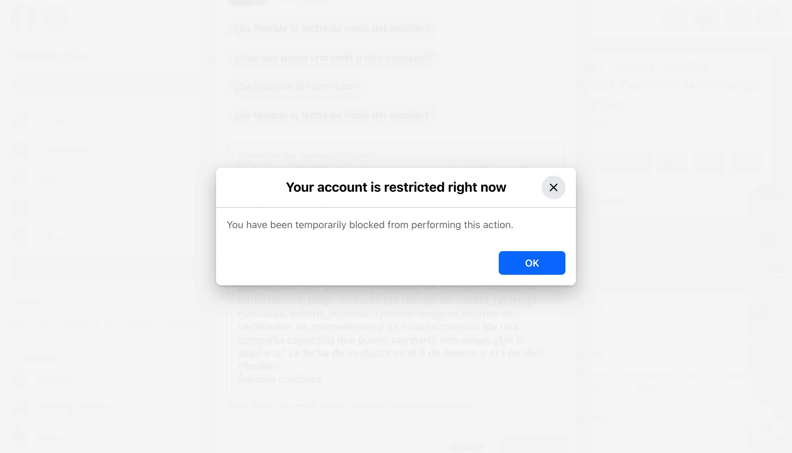

## Requirements
```
brew install python
brew install --cask chromedriver
python -m pip install pipenv
pipenv install -r requirements.txt
```

## Preparation

```
EMAIL=
PASSWORD=
```

message.txt
```
Hi, is it available?
```

## Running

```shell
pipenv run ./src/main.py
```

## What can go wrong?

